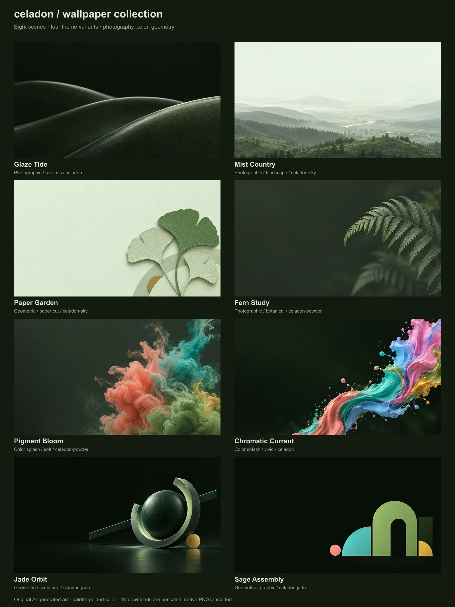

<h1 align="center">Celadon wallpapers</h1>

<em>eight scenes · four variants · calm green</em>

  <a href="https://celadontheme.com">celadontheme.com</a> ·
  <a href="https://github.com/celadon-theme/celadon-theme">celadon-theme</a>

---

Desktop wallpapers for the [Celadon](https://github.com/celadon-theme/celadon-theme)
theme family. Two scenes per variant, palette-guided, generated with OpenAI's
image model from the prompts in [`PROMPTS.md`](PROMPTS.md). No stock photos or
external artwork. No logos, text, or watermarks.

## Before you download

The files in `desktop-4k/` are **3840×2160 upscales** of the untouched
**1672×941 originals** in `originals/`. They are Lanczos-resampled with a
negligible centre crop (the source ratio is within 0.1% of 16:9) and contain
no native 4K detail. Native 4K generation was not available when these were
made. If you'd rather scale yourself, take the original.

## Wallpapers

| # | wallpaper | style | variant | 4K JPEG | original PNG |
|---|---|---|---|---|---|
| 1 | Glaze Tide | photographic · ceramic | `celadon` | [download](desktop-4k/01-glaze-tide-celadon-3840x2160.jpg) | [png](originals/01-glaze-tide-celadon.png) |
| 2 | Mist Country | photographic · landscape | `celadon-sky` | [download](desktop-4k/02-mist-country-celadon-sky-3840x2160.jpg) | [png](originals/02-mist-country-celadon-sky.png) |
| 3 | Paper Garden | geometric · paper cut | `celadon-sky` | [download](desktop-4k/03-paper-garden-celadon-sky-3840x2160.jpg) | [png](originals/03-paper-garden-celadon-sky.png) |
| 4 | Fern Study | photographic · botanical | `celadon-powder` | [download](desktop-4k/04-fern-study-celadon-powder-3840x2160.jpg) | [png](originals/04-fern-study-celadon-powder.png) |
| 5 | Pigment Bloom | color splash · soft | `celadon-powder` | [download](desktop-4k/05-pigment-bloom-celadon-powder-3840x2160.jpg) | [png](originals/05-pigment-bloom-celadon-powder.png) |
| 6 | Chromatic Current | color splash · vivid | `celadon` | [download](desktop-4k/06-chromatic-current-celadon-3840x2160.jpg) | [png](originals/06-chromatic-current-celadon.png) |
| 7 | Jade Orbit | geometric · sculptural | `celadon-jade` | [download](desktop-4k/07-jade-orbit-celadon-jade-3840x2160.jpg) | [png](originals/07-jade-orbit-celadon-jade.png) |
| 8 | Sage Assembly | geometric · graphic | `celadon-jade` | [download](desktop-4k/08-sage-assembly-celadon-jade-3840x2160.jpg) | [png](originals/08-sage-assembly-celadon-jade.png) |

"Photographic" describes the look. These are generated images, not photographs
of real places or objects.

## Variants

| variant | field | wallpapers |
|---|---|---|
| `celadon-sky` | light · sage paper | Mist Country, Paper Garden |
| `celadon-powder` | dark · low contrast | Fern Study, Pigment Bloom |
| `celadon` | dark · medium contrast · **the default** | Glaze Tide, Chromatic Current |
| `celadon-jade` | dark · high contrast | Jade Orbit, Sage Assembly |

## Palette

Colours were supplied to the model as art-direction targets from the hub's
generated palettes at
[`ports/json` @ `8a5090c`](https://github.com/celadon-theme/celadon-theme/tree/8a5090c3714c2ee4d8081cec3e332168adb1df8c/ports/json),
read 2026-09-10. A copy of each variant's palette is in [`palettes/`](palettes/).
Shading and texture contain colours beyond the palette; nothing here is
quantised to exact hex values, and the images are not regenerated when the
palette moves.

## Provenance

| file | what |
|---|---|
| [`PROMPTS.md`](PROMPTS.md) | the full generation prompt for each wallpaper |
| [`manifest.json`](manifest.json) | per-image title, variant, category, sizes, export method, palette revision |
| [`SHA256SUMS.txt`](SHA256SUMS.txt) | checksums for every original, 4K, and preview file — `shasum -a 256 -c SHA256SUMS.txt` |
| [`previews/`](previews/) | small thumbnails |

## License

[MIT](LICENSE)
